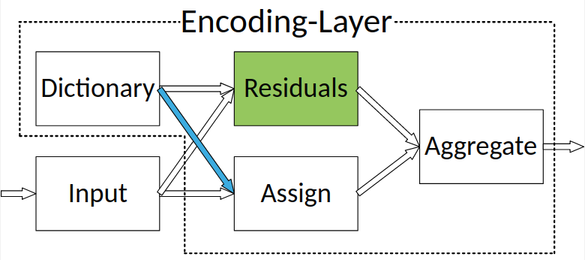

**TODO**:

-  Weight initializers

   -  Logistic Regression init. for ``softmax`` layers (esp. for large
      layers -- e.g., bilinear pooling output)
   -  Try
      `ConvolutionAware <https://github.com/keras-team/keras-contrib/blob/master/keras_contrib/initializers/convaware.py>`__
      for CNNs?

-  Expand base CNN builders

   -  Convert weights from ResNet18/34 pre-trained ``Caffe`` models
   -  Check out wide/dilated ResNet blocks from
      `keras-contrib/applications <https://github.com/keras-team/keras-contrib/blob/master/keras_contrib/applications>`__)

-  Implement *compact* bilinear pooling

-  Figure out Buffer bugs when passing ``covariance_bound`` to
   ``cyvlfeat.gmm.gmm``
-  Tests and benchmarks

keras-texture
=============

Implementations of several ``keras`` layers, model classes, and other
utilities that are useful in constructing models for texture recognition
and fine-grained classification problems. It is a **work in progress**,
and the ``tensorflow`` backend is required for most functionality.

Develop-mode installable with ``pip install -e .`` Root module of
package is ``texture``.

Requirements
------------

-  ``numpy``
-  ``scikit-image``
-  ``keras``>=2.0
-  ``tensorflow``

The TensorFlow requirement is not enforced in ``setup.py``, due to the
ambiguity between ``tensorflow`` and ``tensorflow-gpu``. This package
allows CPU or GPU versions, since some functionality (*e.g.*, Fisher
vector encoding with pretrained models) shouldn't necessarily require a
GPU.

Additional requirements: FV-CNN
^^^^^^^^^^^^^^^^^^^^^^^^^^^^^^^

Use of the Fisher vector CNN class (``texture.fisher.FVCNN``) requires
the `cyvlfeat <https://github.com/menpo/cyvlfeat>`__ wrappers for
VLFeat, which should be installed using conda:
``conda install -c menpo cyvlfeat``, if at all possible. It also
requires ``scikit-learn``, particularly the ``svm.LinearSVC`` class.

Neither of these packages are required in other ``texture`` modules, so
they are not explicitly enforced in ``setup.py``.

Contents
========

``Encoding`` Layer
------------------

The residual encoding layer proposed in `Deep TEN: Texture Encoding
Network <https://arxiv.org/pdf/1612.02844.pdf>`__ [*CVPR*, 2017]. This
``keras`` implementation is largely based on the
`PyTorch-Encoding <https://github.com/zhanghang1989/PyTorch-Encoding>`__
release by the paper authors.

   :alt: Encoding-Layer

   Encoding-Layer

The layer learns a ``KxD`` dictionary of codewords (a "codebook"), and
codeword assignment ``scale`` weights. These are used to encode the
residuals of an input of shape ``NxD`` or ``HxWxD`` with respect to the
codewords. Includes optional L2 normalization of output vectors
(``True`` by default) and dropout (``None`` by default). Unlike the
``PyTorch-Encoding`` version, only the number of codewords ``K`` needs
to be specified at construction time -- the feature size ``D`` is
inferred from the ``input_shape``.

``BilinearModel`` Layer
-----------------------

``BilinearModel`` is a trainable ``keras`` layer implementing the
weighted outer product of inputs with shape
``[(batches,N),(batches,M)]``. The original idea of bilinear modeling
for computer vision problems was proposed in `Learning Bilinear Models
for Two-Factor Problems in
Vision <http://www.merl.com/publications/docs/TR96-37.pdf>`__ [*CVPR*,
1997].

It is used in the ``Deep Encoding Pooling Network (DEP)`` proposed in
`Deep Texture Manifold for Ground Terrain
Recognition <https://arxiv.org/abs/1803.10896>`__ [*CVPR*, 2018] to
merge the output of an ``Encoding`` layer with the output of a standard
global average pooling, where both features are extracted from ``conv``
output of the same ``ResNet`` base. The intuition is that the former
represents textures (orderless encoding) and the latter represents
spatially structured observations, so that "[the] outer product
representation captures a pairwise correlation between the material
texture encodings and spatial observation structures."

.. figure:: ./docs/images/DEP_diagram.png
   :alt: DEP-Architecture

   DEP-Architecture

``KernelPooling`` Layer
-----------------------

Implementation of `Kernel Pooling for Convolutional Neural
Networks <https://vision.cornell.edu/se3/wp-content/uploads/2017/04/cui2017cvpr.pdf>`__
[*CVPR*, 2017]. The layer uses the Count Sketch projection to compute a
*p*-order Taylor series kernel with learnable composition. The
composition weights *alpha* are initialized to approximate a Gaussian
RBF kernel. The kernel is computed over all local feature vectors
``(h_i, w_j)`` in the input volume and then average pooled.

.. figure:: ./docs/images/kernel_pooling_diagram.png

   :alt: Kernel-Pooling

   Kernel-Pooling

Construction paramters include ``p`` (order of the kernel
approximation), ``d_i`` (dimensionality for each order ``i>=2``). Output
has shape ``(batches, 1+C+(p-1)*d_i)``, where ``C`` is the number of
input channels.

The *gamma* parameter, which determines *alpha* values in the
approximation under the assumption of L2-normalized input vectors, can
optionally be estimated using a set of training feature vectors.

Bilinear ``pooling``
--------------------

``bilinearpooling.py`` provides a few convenience functions for creating
symmetric or asymmetric B-CNN models in Keras with bilinear pooling, as
proposed in `Bilinear CNNs for Fine-grained Visual
Recognition <http://vis-www.cs.umass.edu/bcnn/docs/bcnn_iccv15.pdf>`__
(*ICCV*, 2015).

``bilinearpooling.pooling``:

-  Average pooling of local feature vector outer products in
   ``tensorflow``
-  Includes element-wise signed square root and L2 normalization
-  If using ``combine``, you won't need to reference this explicitly

``bilinearpooling.combine``:

-  Takes two ``keras`` models ``fA`` and ``fB`` with output shapes
   ``(N, H, W, cA)``, ``(N, H, W, cB)``
-  Maps ``[fA.output, fB.output]`` to shape ``(N, cA, cB)`` with
   ``bilinear.pooling``
-  Flattens, connects to ``softmax`` output using a specifiable number
   of ``Dense`` layers.
-  Returns the resulting ``keras.models.Model`` instance

Usage Notes
^^^^^^^^^^^

-  Be careful with reuse of single model for ``fA`` and ``fB`` (*e.g.*,
   asymmetry via different output layers). Weights will be shared if you
   use the same instantiation of the original model to generate both
   models.

If the dimensionality of local feature vectors is 512, and there are
``N`` classes, the size of a fully-connected classification layer will
be very large (``512*512*N=262,144*N``). With random weight
initialization, it seems pretty difficult to train a layer of this size
for moderate to large ``N``, so I'm looking at writing an initializer
that uses logistic regression, something which is *not* mentioned in the
paper, but which is present in the authors' matlab release.

FV-CNN
------

The ``texture.fisher`` module provides the ``FVCNN`` class for
generating Fisher vector encodings from pretrained CNNs using the
``cyvlfeat`` wrappers for the ``VLFeat`` C library. A ``FVCNN`` instance
can be constructed with an arbitrary CNN, or with a string specifying
one of the supported ImageNet-pretrained models from
``keras.applications``. A training set of images is required to generate
the Gaussian Mixture Model of local feature vector distribution and
train a support vector classifier. The training set can be a batch-style
4D numpy array, or a list of variable-size 3D image arrays.

Benchmarks
----------

Working on benchmarking models constructed with various texture
recognition datasets:

Some fine-grained classification datasets are also of interest, but
benchmarking those has a lower priority for me at the moment:

-  `Birds-200 <http://www.vision.caltech.edu/visipedia/CUB-200-2011.html>`__
   (2011 version)
-  `FGVC-Aircraft <http://www.robots.ox.ac.uk/~vgg/data/fgvc-aircraft/>`__
-  `Cars <https://ai.stanford.edu/~jkrause/cars/car_dataset.html>`__

Further Improvements
--------------------

Encoding
^^^^^^^^

-  Smaller ``ResNet``-based constructors for feature networks

Bilinear
^^^^^^^^

-  Add Logistic Regression initialization for ``softmax`` layer
-  Add support for ``fA`` and ``fB`` to have different input shapes
   (technically only output shapes need to correspond).
-  Add support for ``fA`` and ``fB`` to have different output shapes
   (crop/interpolate/pool to match them)

Would also like to add the matrix square root normalization layer as
described in:

::

    @inproceedings{lin2017impbcnn,
        Author = {Tsung-Yu Lin, and Subhransu Maji},
        Booktitle = {British Machine Vision Conference (BMVC)},
        Title = {Improved Bilinear Pooling with CNNs},
        Year = {2017}}

Authors claim this improves accuracy by several % on fine-grained
recognition benchmarks.

DEP
^^^

-  Utilities for combining a base CNN with ``Encoding`` &
   ``BilinearModel`` to create a ``Deep Encoding Pooling Network``.
